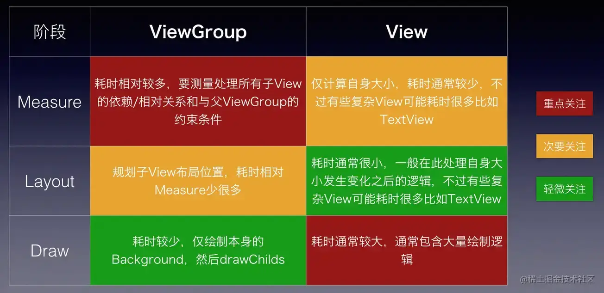

屏幕适配 dp+自适应布局
减少布局层级、减少主线程耗时

UI卡顿的来源：

以60Hz屏幕刷新率为例，每间隔约16.6ms(1000/60，底层就会切换每一帧的画面，
但应用并不是每个16.6ms的刷新信号都可接收到。接收需要注册监听，监听的是屏幕刷新的信号。
注册的时机是，view发起刷新请求时，应用才去向底层注册监听下一个屏幕刷新信号。

应用只负责计算屏幕数据，（测量 布局 绘制 这里不能发生耗时，超过16.6ms就会产生卡顿效果）
这就是为什么，我们说避免丢帧的方法之一：保证每次绘制界面的操作要在16.6ms内完成。

应用在接收到屏幕刷新信号后，去计算屏幕数据，计算完成就完成操作。
CPU计算 GPU渲染存buffer Display每隔16.6ms去读一次数据
display读取的频率是固定的，但是CPU/GPU写数据是完全无规律的。

UI优化 
1. 工作效率的提升    做得快
2. UI性能的提升     体验好

先从原理的角度上去阐述卡顿的原因，与方案策略
1. 减少布局层级
   原理：viewGroup与view在测量布局绘制三个维度对比图  
   
   
   工具：layoutInspect 查看布局层级 
   方法
   1. view的合并
   2. ConstraintLayout 优化布局  强大的布局约束属性，更重要的是性能比RelativeLayout
   FrameLayout(性能最好)>LinearLayout(性能次之)>ConstraintLayout(功能最强大，复杂布局用它)。
   3. LinearLayout关闭baselineAligned  LinearLayout内有多个横向TextView，需优化文字对齐效果时的开关
   开启后因对齐基线会多测量一次，见源码LinearLayout$measure
   4. ViewStub延迟初始化
   5. include布局时善用merge标签，减少嵌套
   6. 减少Overdraw过度绘制 //开发者选项里面的“调试GPU过度绘制”  eg 背景色防止在主题里
   7. Canvas.clipRect/quickReject 
    Canvas.clipRect()可以定义绘制的边界，边界以外的部分不会进行绘制。
    Canvas.quickReject()可以用来测试指定区域是否在裁剪范围之外，如果要绘制的元素位于裁剪范围之外，就可以直接跳过绘制步骤。
   8. 占位图优化 加载完成时，使用透明占位图，核心原理还是减少Overdraw
   9. Alpha blending透明度合成优化
   10. Use Hardware Layer 
   避免在调用频繁的路径(eg:onDraw，onBindViewHolder)创建对象，格式化数据和做大量的计算，善用缓存和局部刷新机制。 

    createView的优化 
    1、不要在xml里，解析xml，生成对象（Framework会大量使用到反射）
    2、使用代码创建可以优化这个过程，但是开发效率低，所以我们用开源的xml转代码工具。eg：X2C
    3、创建UI时，将looper的MessageQueue替换成UI现场Looper的Queue。？？？
    4、Litho 异步布局 将draw放在主线程 测量与布局在子线程  Litho的Yoga 扁平布局

2. 减少主线程耗时 UI耗时查看
    通过TraceView看方法耗时
    通过looper的Printer
    通过Choreographer$postFrameCallback 回调doFrame方法 参数表示此帧时间

ui监控
Choreographer的详细介绍
https://juejin.cn/user/993614240692190/posts

ui卡顿的监控 
方案1 利用UI线程的Looper的Printer匹配（Looper.java源码可见）
方案2 Choreographer的sync的信号量的监控 
https://www.jianshu.com/p/fdb0c48f342b