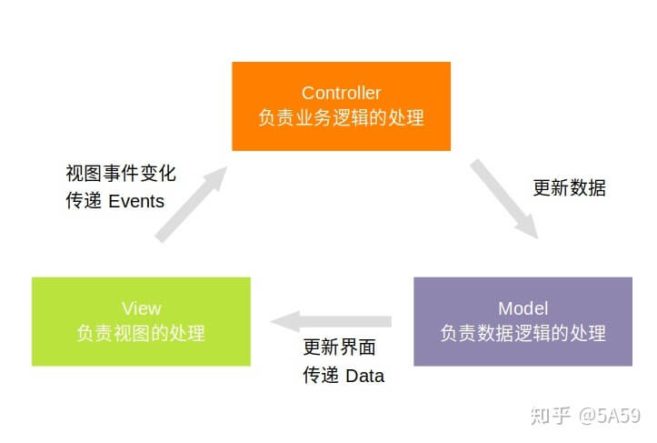

https://zhuanlan.zhihu.com/p/83635530
MVC，MVP，MVVM三个架构模式的目的都是为了解耦Model和View。

### MVC
- View  视图层 用户界面
- Model 数据层 「数据的加载和存储」获取->解析/转换->存储数据
- Controller 控制层 响应从"视图层"输入的指令，操作"数据层"中的数据，产生最终结果。
`视图-控制-视图是这三个框架的base结构`

`数据流向`
View传送指令到Controller，Contorller完成业务逻辑后，要求Model改变状态，
Model将新的数据发送到View，View更新。
V驱动C  C驱动M  M更新V 通信是单向的
View->Controller->Model->View

`MVC的特点`
1. Activity/Fragment 扮演了View与Controller的角色，比较厚重。
2. Model直接操作View，View的修改会导致Controller和Model都进行改动
Controller非常厚重，且Controller与View之间的对应关系，使得View无法复用。

### MVP
- View  视图层，用户界面
- Model 模型，负责数据的加载和存储。
- Presenter 控制器，负责逻辑控制。
MVP将Controller改为Presenter，并改变了通信方向。
1. 各部分间为`双向通信`
2. `View与Model不再相互持有` ，都通过Presenter传递。这里是与MVC的主要区别。

`数据流向`
View<=>Presenter<=>Model  View与Model完全解耦

`MVP缺点`
1. 引入大量接口，导致项目文件数量增多

### MVVM
MVVM模式将Presenter改为ViewModel 
`解决问题` 不仅是View与Model的解耦，还将MVP中的Presenter和View解耦。ViewModel不会持有View。
方案：采用双向绑定，View的变化自动反馈给ViewModel，ViewModel的变化自动反馈给View `数据绑定，界面自动更新` 实现原理：databinding 引入`MutableLiveData` 特点有三
> 与数据实体类一样，可以暂存数据
> 是一个观察者模式的数据实体类，数据更新时，回调注册的观察者。
> 能知晓绑定它的Activity或Fragment的生命周期(有API支持)，且只会给前台活动的Activity回调。
> 实体类或者数据类型变化后的自动通知机制，但不会细节到某个字段。

`数据流向`
View<->ViewModel<=>Model
View产生事件，`自动通知`给ViewModel，ViewModel进行逻辑处理后，通知Model更新数据，Model更新数据后，通知ViewModel，ViewModel`自动通知`View更新。
可以看出来：通过两端的自动通知解耦视图与控制，其余与MVP无差别。
自动通知：通过对view进行数据监听

`MVVM特点`
1. 模块间充分解耦
2. 在MVP的基础上，MVVM把View和ViewModel 也进行了解耦
3. Debug困难，由于View和ViewModel解耦，导致Debug时难以一眼看出View的事件传递

    
