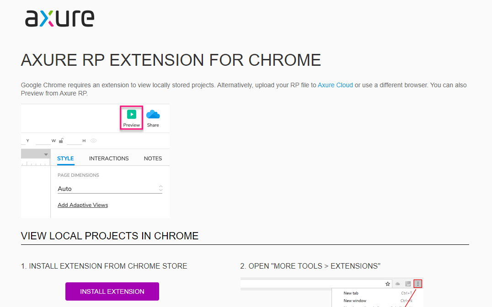

AXURE RP EXTENSION FOR CHROME
最新版的Chrome安装后，打开原型或蓝湖预览，会无法正常展示，而是定位到上述页面。

原因：
没有插件

解决方案：
在原型文档的资源文件中找到插件 -> 目录 xx\resources\chrome\axure-chrome-extension.rx文件
改名为rar文件，并解压到文件夹。

在Chrome中->更多工具->扩展程序->开发者模式->加载已解压的扩展程序->选择上述文件即可